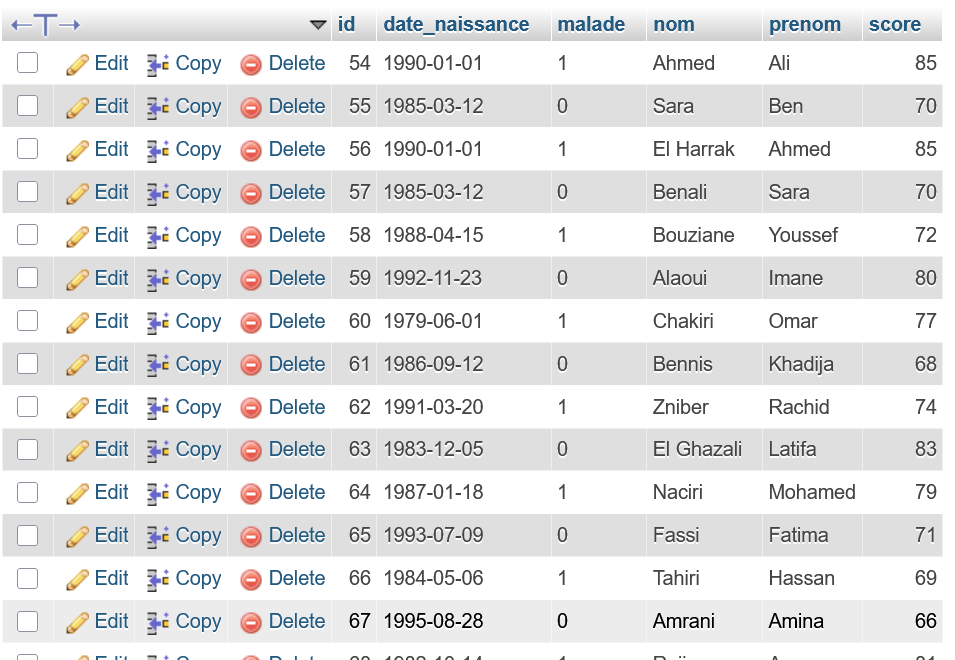
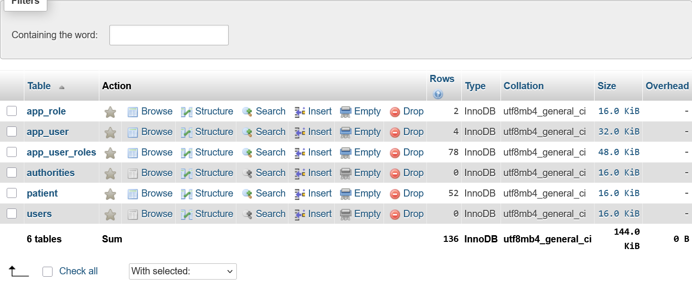
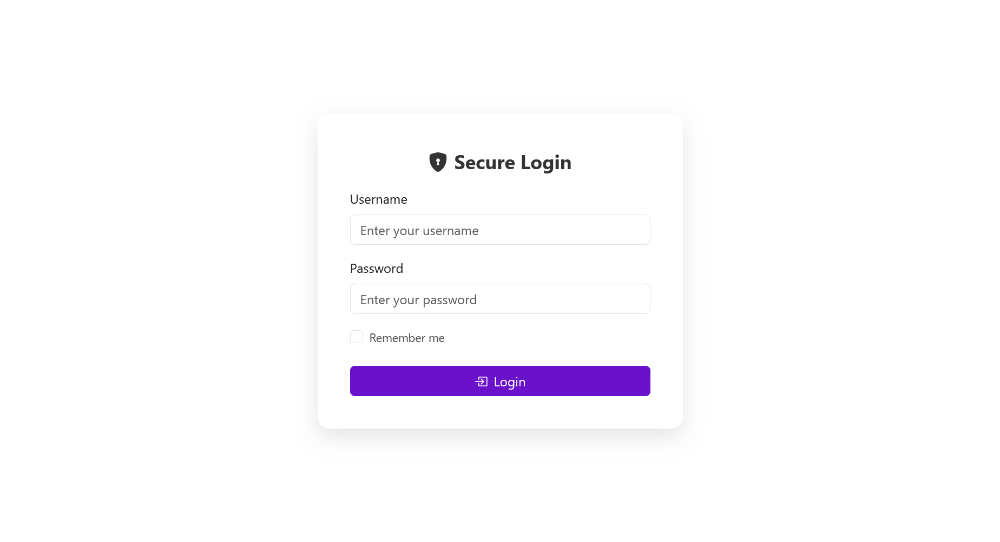
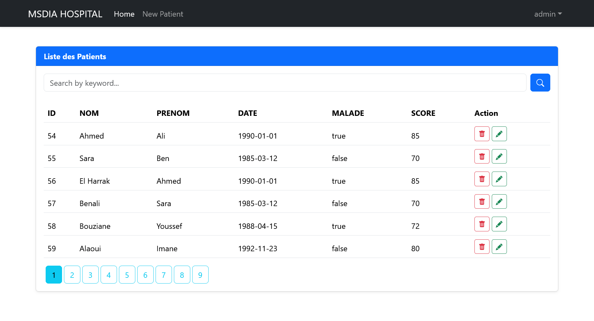
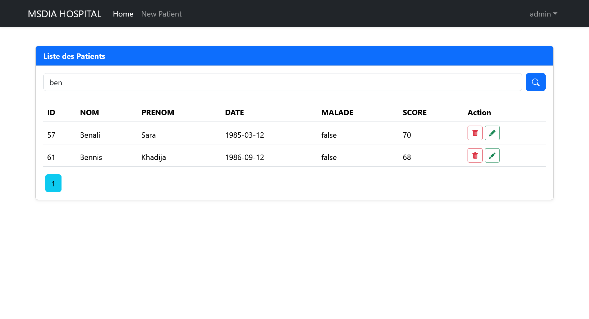
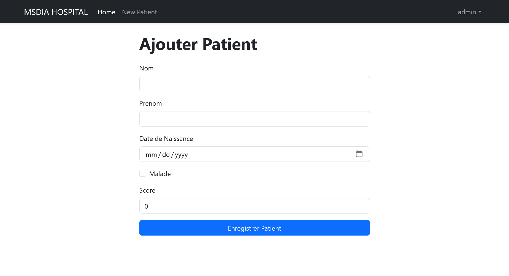
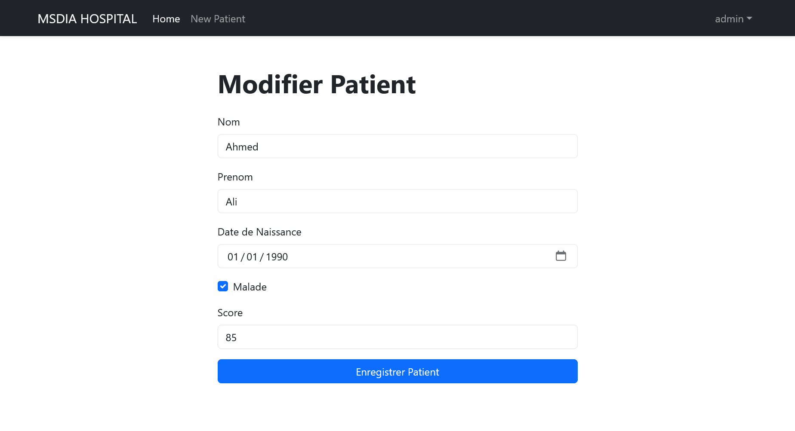
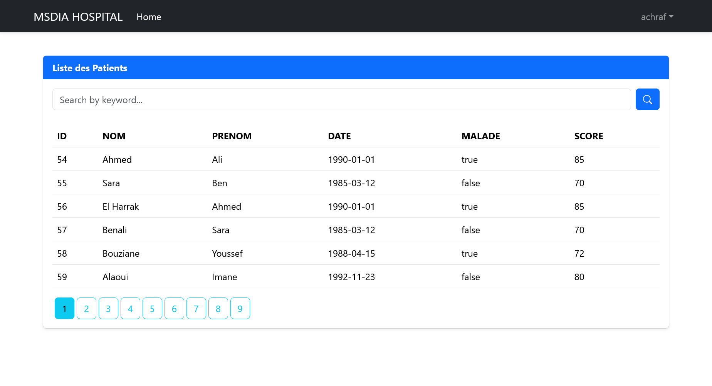
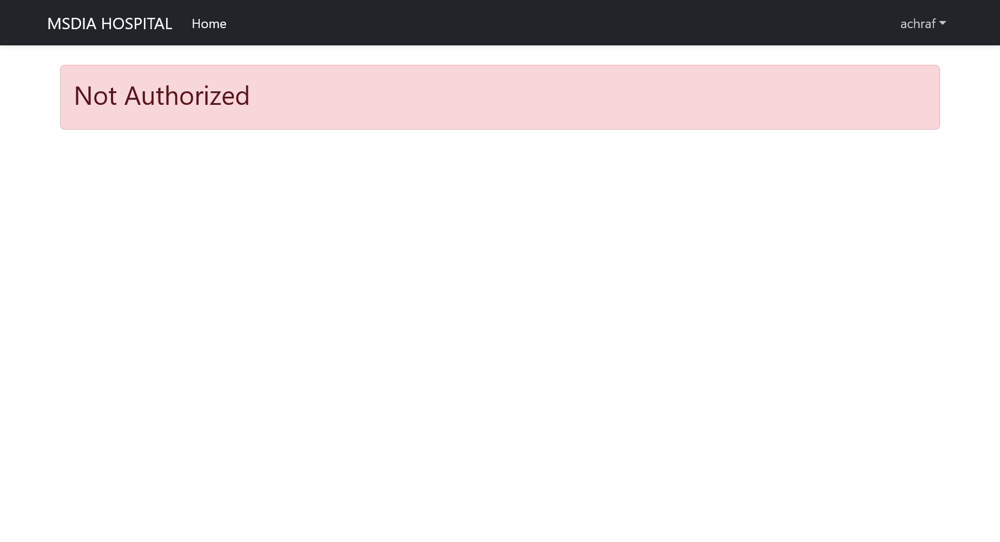

# Rapport Projet TP3 Spring MVC
### Réalisé par : Tichirra Achraf 
### université moulay ismail FSM Master Sdia

## Sommaire

* [Introduction](#introduction)
* [Technologies utilisées](#technologies-utilisées)
* [Architecture du projet](#architecture-du-projet)
* [Modèle de données](#modèle-de-données)
* [Gestion des utilisateurs et rôles (Spring Security)](#gestion-des-utilisateurs-et-rôles-spring-security)
* [Contrôleur PatientController](#contrôleur-patientcontroller)
* [Sécurité avec Spring Security](#sécurité-avec-spring-security)
* [Vue Thymeleaf - Liste des patients](#vue-thymeleaf---liste-des-patients)
* [Fichiers de configuration](#fichiers-de-configuration)
* [Screenshots de l'application](#screenshots-de-lapplication)
* [Conclusion](#conclusion)

---

## Introduction

Ce projet est une application web de gestion des patients réalisée avec Spring Boot et Spring MVC. Elle permet d’ajouter, modifier, rechercher, et supprimer des patients. L’accès aux fonctionnalités est restreint via des rôles (USER, ADMIN).

---

##  Technologies utilisées

* Spring Boot
* Spring MVC
* Spring Security
* Thymeleaf
* Spring Data JPA
* Lombok
* MySQL
* Bootstrap

---

##  Architecture du projet

```
ma.achraf.tp3
├── entities
│   └── Patient.java
├── repository
│   └── PatientRepository.java
├── security
│   ├── entities
│   │   ├── AppUser.java
│   │   └── AppRole.java
│   ├── repository
│   │   ├── AppUserRepository.java
│   │   └── AppRoleRepository.java
│   ├── service
│   │   ├── AccountService.java
│   │   └── AccountServiceImpl.java
│   │   └── UserDetailServiceImpl.java
│   └── SecurityConfig.java
├── web
│   ├── PatientController.java
│   └── SecurityController.java
└── HopitalApplication.java
```

---

## Modèle de données

### Patient.java

```java
@Entity
@Data
@Builder
@NoArgsConstructor
@AllArgsConstructor
public class Patient {
    @Id
    @GeneratedValue(strategy = GenerationType.IDENTITY)
    private Long id;

    @NotEmpty
    @Size(min = 3, max = 40)
    private String nom;

    @NotEmpty
    @Size(min = 2, max = 40)
    private String prenom;

    @NotNull
    @Temporal(TemporalType.DATE)
    @DateTimeFormat(pattern = "yyyy-MM-dd")
    private Date dateNaissance;

    private boolean malade;

    @DecimalMin(value = "50")
    private int score;
}
```

---

## Gestion des utilisateurs et rôles (Spring Security)

### AppUser.java et AppRole.java

```java
@Entity
public class AppUser {
    @Id
    private String userId;
    @Column(unique=true)
    private String userName;
    private String password;
    private String email;

    @ManyToMany(fetch = FetchType.EAGER)
    private Collection<AppRole> roles = new ArrayList<>();
}
```

```java
@Entity
public class AppRole {
    @Id
    private String role;
}
```

### Service AccountService

Fonctions :

* Créer un utilisateur
* Créer un rôle
* Ajouter un rôle à un utilisateur
* Supprimer un rôle

---
### Service AccountService Implementation
```java
@Service
@Transactional
@AllArgsConstructor
public class AccountServiceImpl implements AccountService {

    private AppUserRepository appUserRepository;
    private AppRoleRepository appRoleRepository;
    private PasswordEncoder passwordEncoder;

    @Override
    public AppUser addNewUser(String userName, String password, String confirmPassword, String email) {
        AppUser appUser = appUserRepository.findByUserName(userName);
        if (appUser != null) throw new RuntimeException("User already exist !");
        if (!password.equals(confirmPassword)) throw new RuntimeException("Passwords do not match !");
        appUser = AppUser.builder()
                .userId(UUID.randomUUID().toString())
                .userName(userName)
                .password(passwordEncoder.encode(password))
                .email(email)
                .build();
        AppUser savedAppUser = appUserRepository.save(appUser);
        return savedAppUser;
    }

    @Override
    public AppRole addNewRole(String role) {
        AppRole appRole= appRoleRepository.findById(role).orElse(null);
        if (appRole != null) throw new RuntimeException("Role already exist !");
        appRole=AppRole.builder()
                .role(role)
                .build();
        return appRoleRepository.save(appRole);
    }

    @Override
    public void addRoleToUser(String userName, String role) {
        AppUser appUser = appUserRepository.findByUserName(userName);
        if (appUser == null) throw new RuntimeException("User already exist !");
        AppRole appRole = appRoleRepository.findById(role).orElse(null);
        if (appRole == null) throw new RuntimeException("Role already exist !");
        appUser.getRoles().add(appRole);


    }

    @Override
    public void removeRoleFromUser(String userName, String role) {
        AppUser appUser = appUserRepository.findByUserName(userName);
        AppRole appRole = appRoleRepository.findById(role).get();
        appUser.getRoles().remove(appRole);

    }

    @Override
    public AppUser loadUserByUsername(String username) {
        return appUserRepository.findByUserName(username);
    }
}

```

## Contrôleur PatientController

### Recherche et pagination

```java
@Controller
@AllArgsConstructor
public class PatientController {

    @Autowired
    private PatientRepository patientRepository;

    // chercher les patients
    @GetMapping("/home")
    public String index(Model model,
                        @RequestParam(name = "page" ,defaultValue = "0") int page,
                        @RequestParam(name = "size" ,defaultValue = "6") int size,
                        @RequestParam(name = "keyword" ,defaultValue = "") String keyword) {
        Page<Patient> pagePatient = patientRepository.findByNomContains(keyword, PageRequest.of(page, size));
        model.addAttribute("listPatients",pagePatient.getContent());
        model.addAttribute("pages",new int[pagePatient.getTotalPages()] ); //Pagination
        model.addAttribute("currentPage",page);
        model.addAttribute("keyword",keyword);
        return "patients";
    }

    // delete Patient
    @GetMapping("/admin/delete")
    @PreAuthorize("hasRole('ADMIN')")
    public String delete(Long id, String keyword, int page) {
        patientRepository.deleteById(id);
        return "redirect:/home?page="+page+"&keyword="+keyword;
    }
    @GetMapping("/")
    public String home() {
        return "redirect:/home";
    }

    @GetMapping("/patients")
    @ResponseBody
    public List<Patient> listPatients() {
        return patientRepository.findAll();
    }


    @GetMapping("/formPatient")
    @PreAuthorize("hasRole('ADMIN')")
    public String formPatient(Model model) {
        model.addAttribute("patient", new Patient());
        return "formPatient";
    }

    // save Patient
    @PostMapping("/admin/save")
    @PreAuthorize("hasRole('ADMIN')")
    public String save(Model model, @Valid Patient patient, BindingResult bindingResult,
                       @RequestParam(defaultValue = "0") int page,
                       @RequestParam(defaultValue ="") String keyword) {
        if (bindingResult.hasErrors()) return "formPatient";
        patientRepository.save(patient);
        return "redirect:/home?page="+page+"&keyword="+keyword;
    }

    // editPatient

    @GetMapping("/admin/editPatient")
    @PreAuthorize("hasRole('ADMIN')")
    public String editPatient(Model model, Long id, String keyword, int page) {
        Patient patient = patientRepository.findById(id).orElse(null);
        if (patient == null) throw new RuntimeException("Patient introuvable");
        model.addAttribute("patient",patient);
        model.addAttribute("page",page);
        model.addAttribute("keyword",keyword);
        return "editPatient";
    }

}

```

### Sécurisation par rôle ADMIN

```java
@PreAuthorize("hasRole('ADMIN')")
@GetMapping("/admin/delete")
public String delete(Long id, String keyword, int page) {
    
}
```

---

## Sécurité avec Spring Security

###  Configuration
#### InMemomy Authentication
```java
// @Bean
public InMemoryUserDetailsManager inMemoryUserDetailsManager() {
    return new InMemoryUserDetailsManager(
            User.withUsername("achraf").password(passwordEncoder.encode("12345")).roles("USER").build(),
            User.withUsername("admin").password(passwordEncoder.encode("12345")).roles("USER","ADMIN").build()
    );
}
```
#### JDBC Authentication
```java
// @Bean
public JdbcUserDetailsManager jdbcUserDetailsManager(DataSource dataSource) {
    return new JdbcUserDetailsManager(dataSource);
}
```
#### UserDetails Config 
```java
 @Bean
public SecurityFilterChain securityFilterChain(HttpSecurity httpSecurity) throws Exception {
    return httpSecurity
            .authorizeHttpRequests(auth -> auth
                    .requestMatchers("/user/**").hasRole("USER")
                    .requestMatchers("/admin/**").hasAnyRole("ADMIN", "USER")
                    .requestMatchers("/webjars/**", "/h2-console/**").permitAll()
                    .anyRequest().authenticated()
            )
            .rememberMe(Customizer.withDefaults())
            .exceptionHandling(exception -> exception
                    .accessDeniedPage("/notAuthorized")
            )
            .formLogin(form -> form
                    .loginPage("/login")
                    .defaultSuccessUrl("/")
                    .permitAll()
            )
            .userDetailsService(userDetailServiceImpl)
            .build();
}
```
#### UserDetails Service Implementation
```java

@Service
@AllArgsConstructor
public class UserDetailServiceImpl implements UserDetailsService {
    private AccountService accountService;

    @Override
    public UserDetails loadUserByUsername(String username) throws UsernameNotFoundException {
        AppUser appUser = accountService.loadUserByUsername(username);
        if (appUser == null) throw new UsernameNotFoundException(String.format("User %s not found", username));

        String[] roles = appUser.getRoles().stream().map(u -> u.getRole()).toArray(String[]::new);
        UserDetails userDetails = User
                .withUsername(appUser.getUserName())
                .password(appUser.getPassword())
                .roles(roles).build();
        return userDetails;
    }
}

```
---

## 🖼️ Vue Thymeleaf - Liste des patients

### patients.html (extrait)

```html
<form method="get" th:action="@{/home}" class="d-flex mb-4">
    <input type="text" name="keyword" th:value="${keyword}" />
    <button type="submit" class="btn btn-primary">
        <i class="bi bi-search"></i>
    </button>
</form>
...
<td th:if="${#authorization.expression('hasRole(''ADMIN'')')}">
    <a th:href="@{/admin/delete(...) }" class="btn btn-sm btn-outline-danger">...</a>
    <a th:href="@{/admin/editPatient(...) }" class="btn btn-sm btn-outline-success">...</a>
</td>
```

---

## ⚙️ Fichiers de configuration

### application.properties

```properties
spring.application.name=TP3_Management_Hopital
server.port=8084

spring.datasource.url=jdbc:mysql://localhost:3306/sdia-hopital?createDatabaseIfNotExist=true
spring.datasource.username=root
spring.datasource.password=

spring.jpa.hibernate.ddl-auto=update
spring.jpa.properties.hibernate.dialect=org.hibernate.dialect.MySQL8Dialect
spring.jpa.defer-datasource-initialization=true
spring.sql.init.mode=always

spring.mvc.format.date=dd/MM/yyyy
```

---

## Screenshots de l'application

### Base de donnes


---


### Login Page



### Page Liste des patients (Admin)


---


### Page Edit et Ajouter Patient (Admin)


---



### Page Liste des patients (User)


### Si l'utilisateur souhaite accéder à la page d'ajout d'un patient.



---

## Conclusion

Ce projet Spring Boot permet de gérer des patients avec un système sécurisé d’authentification et d’autorisation. Il utilise JPA pour la gestion des données, la validation des champs, et Spring Security pour le contrôle des accès selon les rôles. Il offre une base solide pour développer des applications web sécurisées.
